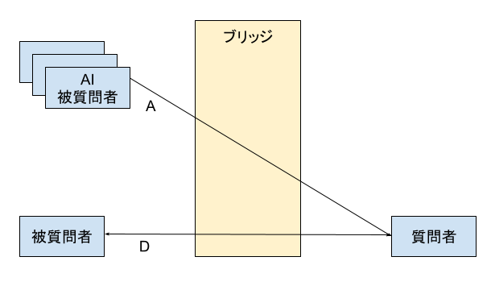
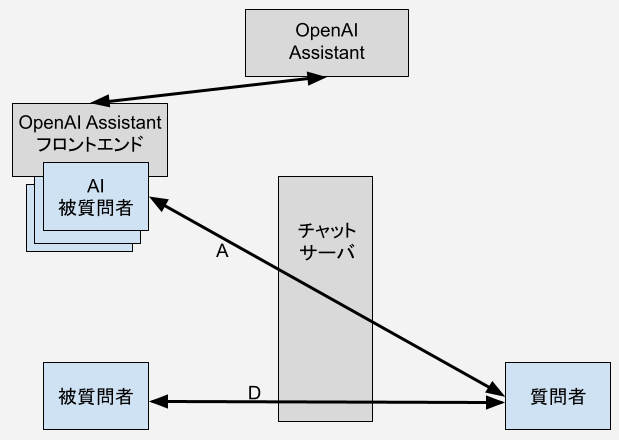

OpenAI対応RISTEXチャットサーバ
==============================

某プロジェクトのOpenAI Assistantフロントエンドとチャットサーバ

## 全体概要



いまここ↓



## チャットサーバ

- 起動方法

```
python chatmain.py conf.json
```

## チャットサーバのコンフィグ

- server_cert, server_address, server_portは環境に応じて設定する。
- server_certは、証明書と鍵を並べたファイル。PEM形式。空にするとHTTPサーバとして起動する。
- max_queue_size: ブラウザから接続する際の待ち行列の大きさ。
- apikey_storage: OpenAI AssistantのAPIキーが入ったファイル。
- assistants_storage: OpenAI Assistantに作ったAI被質問者のAssistants IDのリスト。JSON形式。チャットサーバはここからランダムに選択する。

assistants_storageのサンプル
```
[
    "asst_3QFD4........i8iCwgUGVHA",
    "asst_v02UQ........vzcn9Wrbmd2"
]
```

設定ファイルのサンプル。
```
{
    "server_cert": "",
    "server_address": "",
    "server_port": 80,
    "www_path": "./www",
    "max_queue_size": 100,
    "apikey_storage": "apikey.txt",
    "log_file": "chatserver.log",
    "log_stdout": true,
    "enable_debug": true,
    "tz": "Asia/Tokyo",
    "assistants_storage": "assistants.json"
}
```

## ツール

```
python retry_request.py -k apikey.txt -i chat_history_056-20241019.json -o chat_history_056-20241019-retry01.json
```

```
python retry_check_result.py  chat_history_056-20241019-retry01.json
```

## TODO
- AI質問者の実装

## requirement

openai
fastapi
aiofiles
